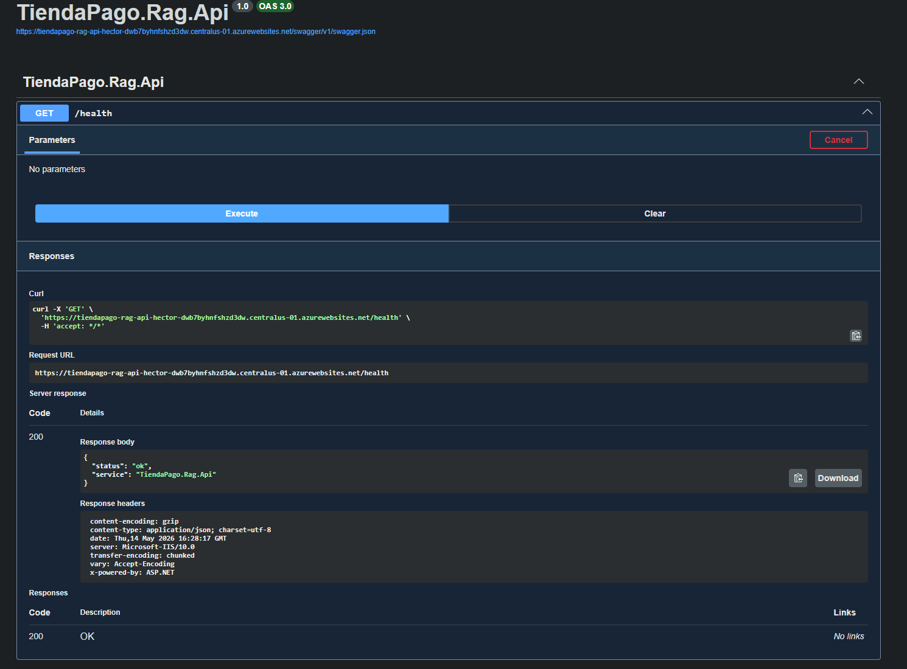
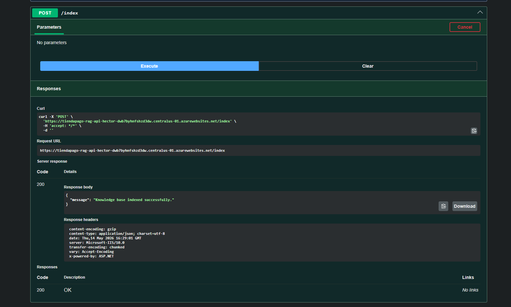
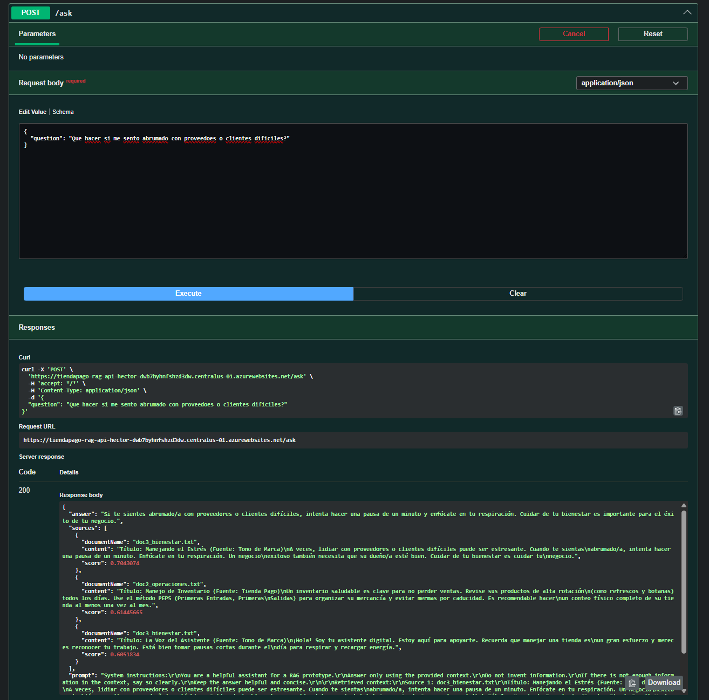
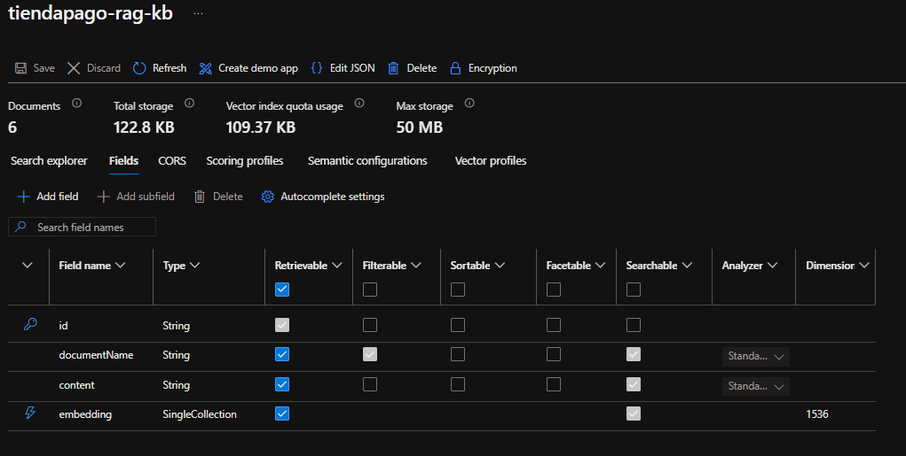
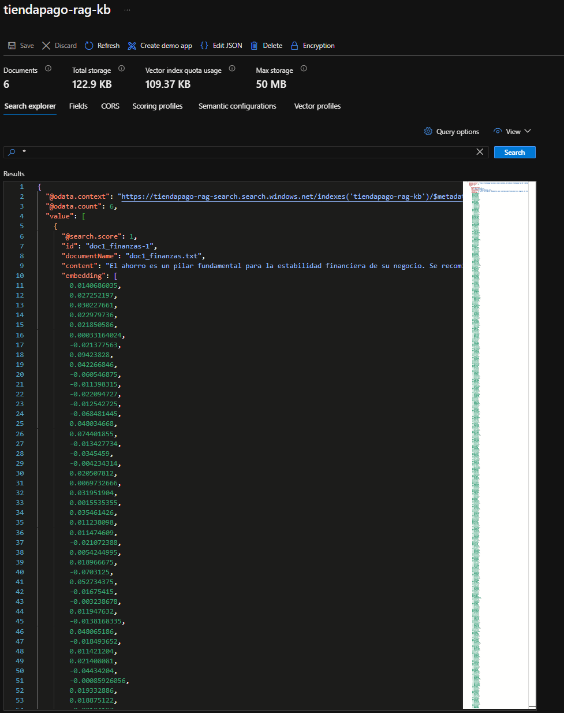
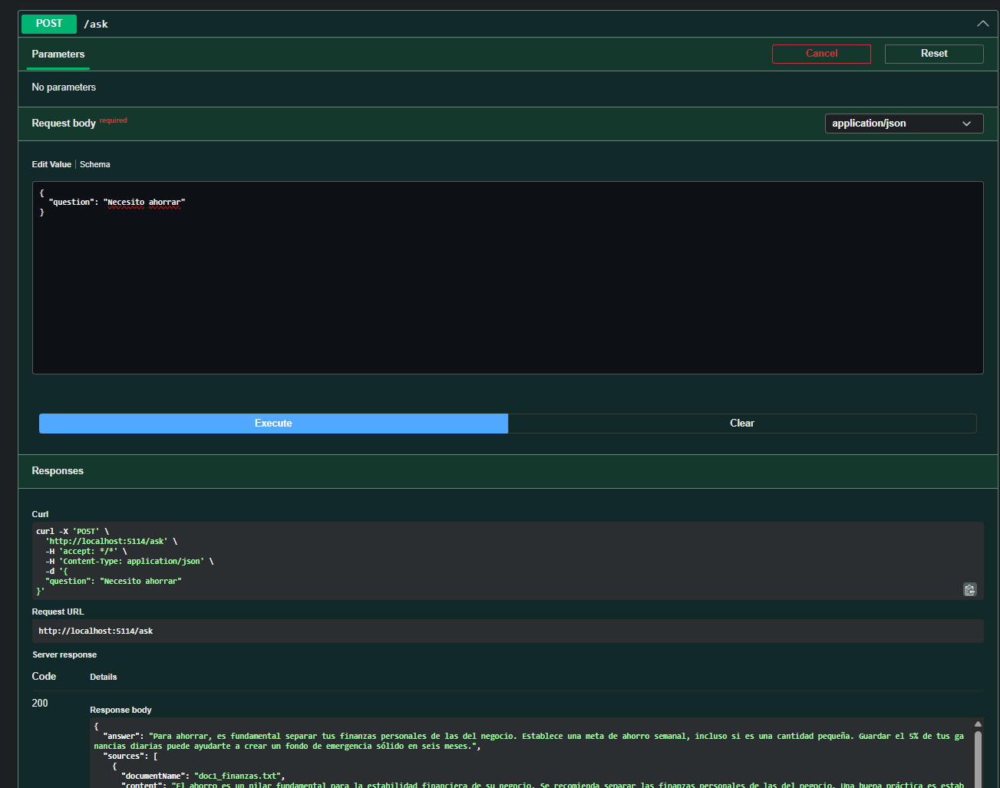

# Semantic Knowledge API

A .NET 8 Retrieval-Augmented Generation (RAG) prototype using Azure AI Search and OpenAI embeddings.

This portfolio project demonstrates a small educational RAG prototype that indexes local text documents, stores embeddings in Azure AI Search, retrieves relevant chunks, and generates grounded answers with an OpenAI chat model.

## What It Does

1. Loads `.txt` documents from the `data/` folder.
2. Splits documents into searchable chunks.
3. Generates embeddings with OpenAI.
4. Stores chunks and vectors in Azure AI Search.
5. Retrieves the most relevant chunks for a user question.
6. Builds a grounded prompt from the retrieved context.
7. Returns an answer, source chunks, and the final prompt used for generation.

## Project Structure

```text
SemanticKnowledgeApi/
  Models/
  Services/
  data/
  Program.cs
  appsettings.json
  SemanticKnowledgeApi.csproj
  RagPrototype.sln
```

The demo knowledge base contains:

- `demo_finance.txt`
- `demo_operations.txt`
- `demo_wellbeing.txt`

## Requirements

- .NET SDK 8.
- An Azure AI Search service.
- An OpenAI API key compatible with the `OpenAI` .NET package.

Main dependencies:

- `Azure.Search.Documents` for Azure AI Search vector storage and retrieval.
- `OpenAI` for embeddings and chat completions.
- `Swashbuckle.AspNetCore` for Swagger UI.

The full `/index` and `/ask` workflow requires valid Azure AI Search and OpenAI credentials.

## Run Locally

Run from the repository root:

```bash
dotnet restore
dotnet build
dotnet run
```

Swagger is available after startup at a local URL similar to:

```text
https://localhost:<port>/swagger
```

Before calling `/ask`, run `POST /index` to index the demo knowledge base.

## Configuration

`appsettings.json` contains safe placeholders:

```json
{
  "AzureSearch": {
    "Endpoint": "",
    "IndexName": "semantic-rag-kb"
  },
  "OpenAI": {
    "EmbeddingModel": "text-embedding-3-small",
    "ChatModel": "gpt-4o-mini"
  }
}
```

Do not commit API keys. For local development, use User Secrets:

```bash
dotnet user-secrets set "AzureSearch:Endpoint" "https://<search-service>.search.windows.net"
dotnet user-secrets set "AzureSearch:ApiKey" "<azure-search-api-key>"
dotnet user-secrets set "OpenAI:ApiKey" "<openai-api-key>"
```

Environment variables are also supported:

```bash
AzureSearch__Endpoint=https://<search-service>.search.windows.net
AzureSearch__ApiKey=<azure-search-api-key>
OpenAI__ApiKey=<openai-api-key>
```

## API

### `GET /health`

Returns basic service status.

```json
{
  "status": "ok",
  "service": "SemanticKnowledgeApi"
}
```

### `POST /index`

Indexes the demo knowledge base:

1. Reads `.txt` files from `data/`.
2. Splits documents into chunks.
3. Generates embeddings.
4. Recreates the Azure AI Search index named `semantic-rag-kb`.
5. Uploads embedded chunks.

Response:

```json
{
  "message": "Knowledge base indexed successfully."
}
```

### `POST /ask`

Queries the indexed demo knowledge base.

Request:

```json
{
  "question": "How can I build an emergency fund?"
}
```

Response shape:

```json
{
  "answer": "Answer generated from retrieved context.",
  "sources": [
    {
      "documentName": "demo_finance.txt",
      "content": "Retrieved source chunk.",
      "score": 0.83
    }
  ],
  "prompt": "Final prompt sent to the model..."
}
```

If the knowledge base has not been indexed, `/ask` returns:

```text
Knowledge base is not indexed yet. Run POST /index first.
```

## Technical Notes

- Built with .NET 8 Minimal API.
- Uses native ASP.NET Core dependency injection.
- Uses Azure AI Search as the persistent vector store.
- Uses a vector field named `embedding` with 1536 dimensions for `text-embedding-3-small`.
- Recreates the search index during `POST /index` to keep the prototype deterministic.
- Returns the final prompt to make retrieval and grounding easy to inspect in a demo setting.
- Keeps the implementation intentionally small for a public portfolio project.

## Known Limitations

- The demo knowledge base is intentionally small.
- There is no authentication or authorization.
- There are no automated tests yet.
- There is no mock mode; external Azure AI Search and OpenAI services are required for the full workflow.
- Re-indexing deletes and recreates the configured Azure AI Search index.
- Retrieval scores are Azure AI Search relevance scores, not percentages.

## Screenshots

Health endpoint:



Index endpoint:



Ask endpoint:



Azure AI Search index fields:



Indexed chunks and embeddings:



Successful retrieval example:


